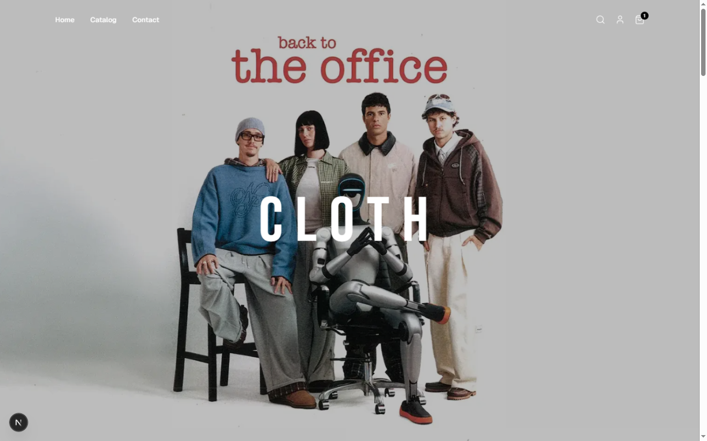
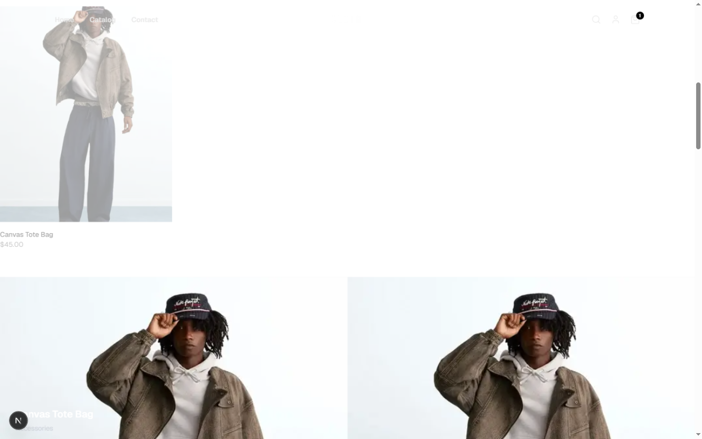
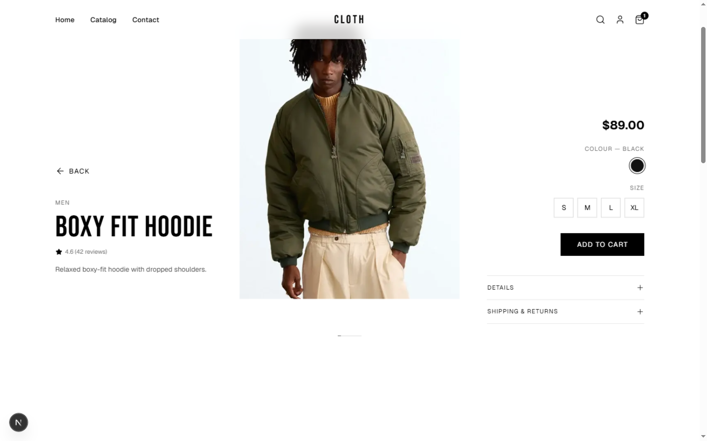
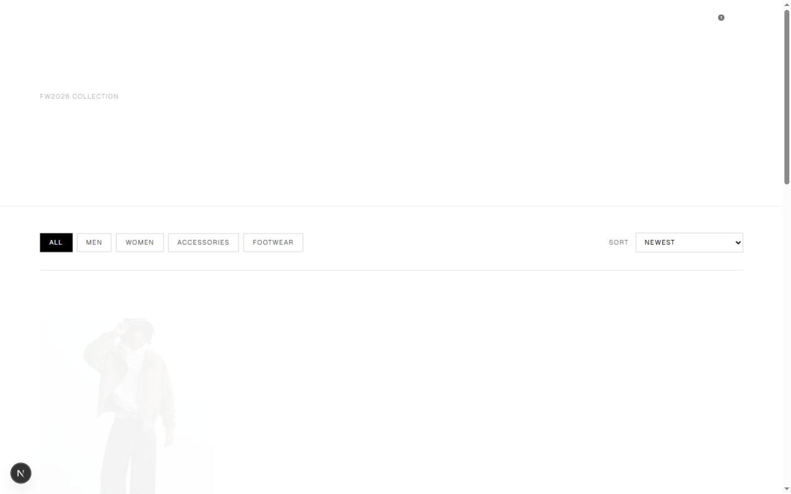
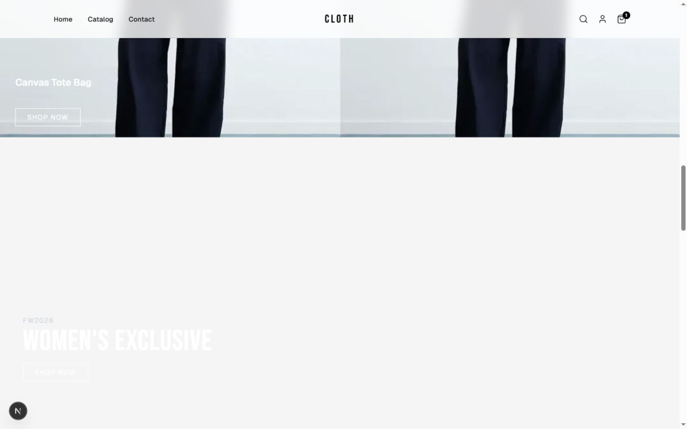
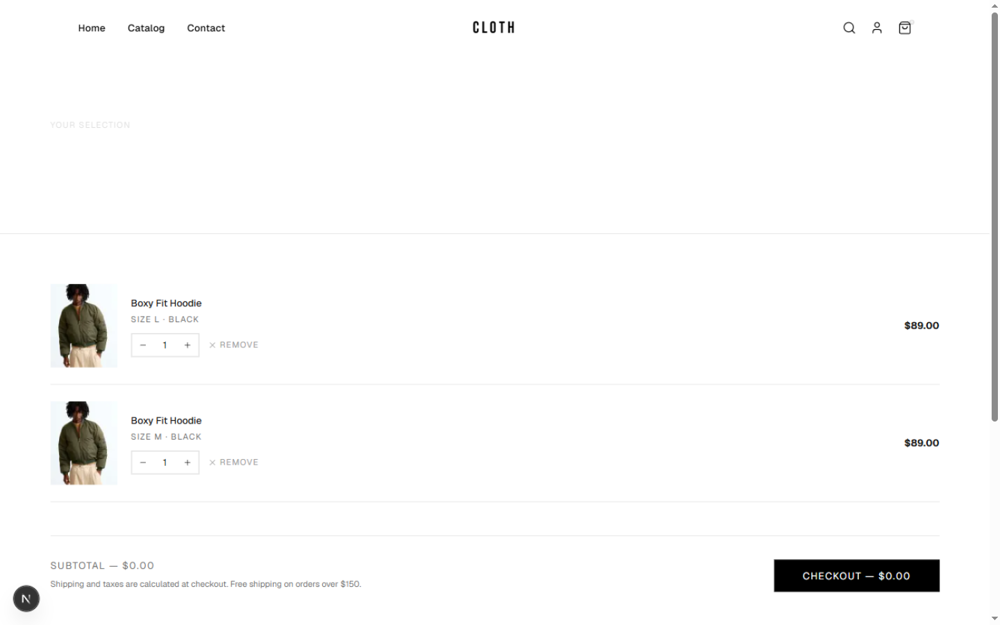
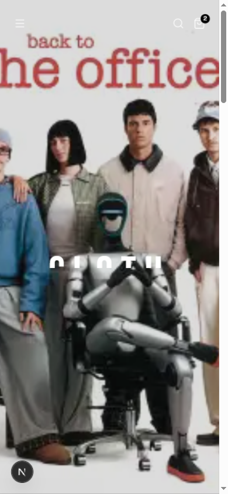
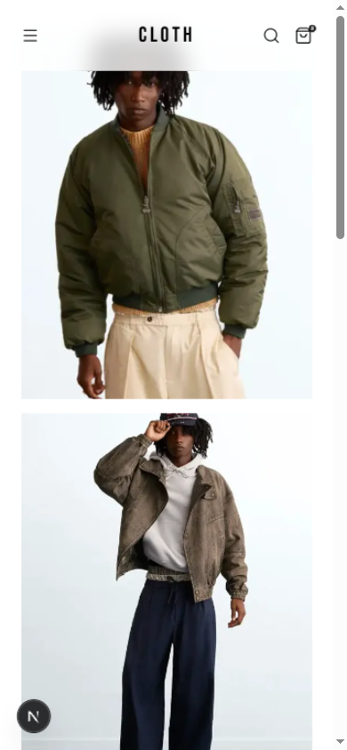

# CLOTH — Fashion E-Commerce Storefront

**CLOTH** is a minimal, editorial-style fashion storefront built with Next.js and powered by a Medusa.js backend. Black-and-white typography, full-bleed photography, and motion-first interactions — every section is animated, every page is responsive, and the entire catalog is served from a real e-commerce engine.

  

## Design

The design language is a restrained fashion-editorial system:

- **Typography as identity** — the display font (Bebas Neue) carries every heading in wide-tracked capitals, paired with a quiet grotesque for body copy
- **Monochrome palette** — pure black on white, hairline dividers, no color except the photography
- **Full-bleed imagery** — photography fills sections edge to edge; content floats over it
- **Motion everywhere** — page-to-page directional slides (forward slides left, back slides right), a shared-element morph that grows a product card into its detail page, scroll-linked hero parallax where the title glides up into the navbar, staggered reveals on every section, and micro-interactions on every button

  

## Function

### Storefront

- **Catalog** — 12 products across Men, Women, Accessories and Footwear, with live category filtering and sorting (newest, price, rating)
- **Product pages** — scroll-driven parallax that cross-fades between product shots with an editorial 01/02 progress counter, color and size selection, ratings, and expandable detail sections
- **Search** — the navbar search expands inline into a live product search with image results
- **Cart** — fully functional: add with size + color, quantity steppers, removal, live subtotal, persisted across sessions and synced to the backend
- **Collections** — curated landing pages (Men's, Women's, New Arrivals)
- **Account & Contact** — sign-in/register UI with validation, contact form with inline validation and success states
- **Policies** — editorial shipping and returns pages

  

### Administration

The store is managed from the built-in Medusa Admin dashboard (`/app`):

- **Products, variants, categories, orders** — full CRUD through the dashboard
- **Site Content** — a custom dashboard page where the client edits every homepage section (hero image, titles, all three banners) and uploads new imagery, no code required. Changes go live on the storefront within a minute.
- **Image storage** — uploads land in Neon Object Storage (S3-compatible)

  

## Screens

| Home — spotlight | Cart |
| --- | --- |
|  |  |

| Contact | Mobile |
| --- | --- |
|  |  |

## Built with

- [Next.js 16](https://nextjs.org) — App Router, React Server Components, View Transitions API
- [Medusa.js v2](https://medusajs.com) — headless commerce engine, Postgres (Neon)
- [Motion](https://motion.dev) — page transitions, scroll-linked animation, micro-interactions
- [Tailwind CSS v4](https://tailwindcss.com) — utility styling
- [Neon Object Storage](https://neon.com/docs/storage/overview) — S3-compatible image hosting

  

